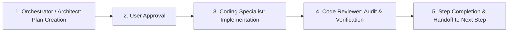

# Methik - Project Agent Instructions & Architecture Reference

## Overview & Mission
Methik is an ultra-lightweight, **100% portable**, modular Video & Audio Downloader desktop application.
It integrates with `yt-dlp` and `FFmpeg` to fetch metadata and stream downloads from **1,000+ websites** (YouTube, TikTok, Instagram Reels & Stories, Facebook, Twitter / X, Reddit, Twitch, SoundCloud, and more), wrapped in a high-performance **Rust (Tauri v2)** backend and a **Frosted Glass (Glassmorphism)** minimalist frontend.

## Multi-Agent Development Workflow

To ensure zero hallucination, maximum code quality, and strict adherence to architecture, development proceeds under a structured multi-agent protocol:

> **MANDATORY RULE 0 - ALWAYS PLAN FIRST**: Before writing, editing, or deleting ANY codebase files, a detailed architectural/implementation plan MUST be drafted and approved by the user. Unplanned modifications are strictly forbidden.



1. **`/orchestrator` / `/architect`**:
   - Decomposes tasks into atomic, checkable steps.
   - Formulates exact scope, affected files, and verification criteria.
   - Obtains explicit user approval before execution.
2. **`/coding-specialist`**:
   - Implements approved steps completely without placeholders or shortcuts.
   - Follows strict modularity, clean error handling, and memory/size efficiency.
3. **`/code-reviewer`**:
   - Audits code for security, performance, DRY principles, and adherence to portability and monochrome SVG rules.
   - Verifies tests and compilation (`cargo check`, `cargo test`) before sign-off.

---

## Key Architectural Principles

1. **100% Portability & Shared Library Architecture**:
   - The user does **NOT** need to manually install Python, `yt-dlp`, or `ffmpeg` to their system `$PATH`.
   - External binaries are shared across curlyzed apps in `%LOCALAPPDATA%/curlyzed/bin/` (and `%LOCALAPPDATA%/curlyzed/`) to prevent duplicate storage.
   - Methik maintains isolated logs and settings in `%LOCALAPPDATA%/curlyzed/Methik/` (`logs/`, `config/settings.json`, `updates/`).
   - The application includes an auto-provisioner module that silently/transparently downloads and verifies `yt-dlp.exe`, `ffmpeg.exe`, `ffprobe.exe`, and `deno.exe` directly into the shared library directory (`%LOCALAPPDATA%/curlyzed/bin/`).
   - **Priority Binary Resolution**:
     1. `%LOCALAPPDATA%/curlyzed/bin/` and `%LOCALAPPDATA%/curlyzed/` (Shared curlyzed libraries)
     2. `%LOCALAPPDATA%/curlyzed/Methik/bin/` & `%APPDATA%/Methik/bin/` (Isolated Methik AppData fallback)
     3. Executable relative `./bin/` (Portable USB drive mode)
     4. System `$PATH` fallback

2. **Browser Cookie Authentication & Multi-Platform Support**:
   - Seamless extraction and injection of browser cookies via `--cookies-from-browser <BROWSER>` (supports Chrome, Edge, Firefox, Brave, Opera, Vivaldi, Chromium, Safari).
   - Supports custom Netscape cookie file selection (`--cookies <PATH>`).
   - Enables downloading member-only, age-restricted, and private social media content without exposing login credentials.

3. **Strict Layered Non-Monolithic Architecture**:
   - **Presentation (Frontend)**: Vanilla HTML5, Vanilla CSS3 (Glassmorphism), Vanilla ES6+ JS Modules. Zero heavy JS frameworks (React, Vue, Node.js runtime). Total frontend bundle under 50 KB. All files strictly modularized (< 350 lines per file).
   - **Tauri IPC Command Layer** (`src-tauri/src/commands/`): Thin handlers exposing commands and streaming async progress events.
     - `metadata`: `get_video_info`, `get_playlist_info`
     - `download`: `download_video`, `download_playlist`, `download_queue`, `cancel_download`
     - `system`: `check_system_dependencies`, `provision_dependencies`, `cancel_provisioning`, `open_logs_folder`, `open_download_folder`, `open_media_file`, `open_bin_folder`, `open_appdata_folder`, `open_url`, `uninstall_binaries`, `check_for_updates`, `download_and_apply_update`, `cancel_update`, `get_app_info`, `get_system_paths`, `get_user_settings`, `save_user_settings_command`, `select_download_folder`, `select_cookie_file`, `read_clipboard`, `log_client_event`, `is_dev_mode`
     - `window`: `toggle_always_on_top`, `minimize_window`, `toggle_maximize_window`, `close_window`, `set_view_window_mode`
   - **Core Domain** (`src-tauri/src/core/`): Pure data models (`VideoMetadata`, `PlaylistMetadata`, `DownloadProgress`, `FormatInfo`), traits, and strongly-typed errors (`thiserror`).
   - **Engine Layer** (`src-tauri/src/engine/`): Dependency locator, AppData auto-provisioner, argument builder, stdout stream parser, updater, process spawner (`process.rs`), and child process executor.
   - **Config Layer** (`src-tauri/src/config/`): AppData paths, directory resolution, and settings persistence.

4. **UI, Aesthetics & Iconography Standards**:
   - **Monochrome Minimal Vector SVGs Only (STRICT ZERO EMOJI POLICY)**: NEVER use system emojis (e.g. ⚡, ⚙️, 🎵, ✓, ✕) or colored clipart characters anywhere in text, labels, status messages, or UI elements. All indicators must use crisp, lightweight monochrome stroke SVGs (`stroke: currentColor; fill: none; stroke-width: 2`).
   - **Custom Frosted Glass Dropdowns (NO Native OS `<select>`)**: Native OS `<select>` popup menus are forbidden because WebView2/Windows renders opaque, unstyled grey/white boxes. All dropdown menus must be custom glassmorphic overlay components (`backdrop-filter: blur(28px)`, translucent borders, smooth transitions).
   - **Frosted Glass (Glassmorphism)**: `backdrop-filter: blur(28px)`, subtle translucent borders (`rgba(255, 255, 255, 0.12)`), ambient glows, and seamless Dark/Light theme switching.
   - **Desktop Controls**: Titlebar pin toggle (`Always on Top`), Settings modal (themes, browsers & engines), About modal (credits & logs), Reveal in Explorer and Open Folder buttons, and first-launch missing dependencies warning banner.

5. **Smallest Binary Footprint & PowerShell Toolchain**:
   - Uses OS-native webview (WebView2 on Windows).
   - Cargo release build size optimizations: `opt-level = "z"`, `lto = true`, `codegen-units = 1`, `panic = "abort"`, `strip = true`.
   - Tooling scripts in workspace root:
     - `run.ps1`: Dev environment check and Tauri runner.
     - `build-release.ps1`: Standalone release packager with UPX compression.
     - `bump-version.ps1`: Synchronized multi-manifest version bumper.

## Directory Structure
```text
methik/
├── .agents/                      # Local AI agent rules (ignored in git)
│   └── rules/
│       ├── architecture.md       # Architectural rules and guidelines (Anti-monolithic policy)
│       ├── workflow.md           # Multi-agent workflow protocol aggregator
│       ├── orchestrator.md       # Workflow Director role specification
│       ├── architect.md          # System Architect role specification
│       ├── coding-specialist.md  # Primary Implementer role specification
│       └── code-reviewer.md      # Quality Gatekeeper & Auditor role specification
├── .gitignore                    # Git ignore configurations
├── AGENTS.md                     # This reference file
├── Cargo.lock                    # Cargo dependency lockfile
├── Cargo.toml                    # Root workspace config
├── LICENSE                       # GNU General Public License v3
├── README.md                     # User documentation
├── build-release.ps1             # Optimized release build script
├── bump-version.ps1              # Version synchronization script
├── package.json                  # NPM scripts & Tauri CLI wrapper
├── package-lock.json             # NPM lockfile
├── run.ps1                       # Dev launcher script
├── src-tauri/                    # Rust backend
│   ├── Cargo.toml                # Backend crate dependencies
│   ├── tauri.conf.json           # Tauri v2 application configuration
│   ├── build.rs                  # Build script
│   ├── icons/                    # Application icons (.ico, .png, .icns)
│   └── src/
│       ├── main.rs               # Desktop executable entrypoint
│       ├── lib.rs                # Core Tauri setup & plugin registration
│       ├── commands/             # Tauri IPC command handlers
│       │   ├── mod.rs
│       │   ├── download.rs       # Video & Playlist download execution
│       │   ├── metadata.rs       # Single video & Playlist info fetching
│       │   ├── system.rs         # Dependencies, Explorer, updater, logs
│       │   └── window.rs         # Always-on-top & window state
│       ├── config/               # Settings & AppData paths
│       │   ├── mod.rs
│       │   └── paths.rs
│       ├── core/                 # Models, errors, traits
│       │   ├── mod.rs
│       │   ├── error.rs
│       │   └── models.rs
│       └── engine/               # yt-dlp, FFmpeg engine & provisioner
│           ├── mod.rs
│           ├── args_builder.rs   # CLI argument construction (formats, cookies)
│           ├── dependency.rs     # Binary locator & version validation
│           ├── parser.rs         # JSON & stream progress parser
│           ├── process.rs        # Detached background process creation
│           ├── provisioner.rs    # Auto-provisioning & GitHub release fetcher
│           ├── updater.rs        # App version check & update notifier
│           └── ytdlp.rs          # Subprocess executor
└── ui/                           # Minimalist Frosted Glass Webview (Vanilla ES Modules)
    ├── icon.png                  # App icon asset
    ├── index.html                # Main UI layout & modal overlays
    ├── css/
    │   ├── style.css             # Main stylesheet aggregator
    │   ├── base/
    │   │   ├── variables.css     # Design tokens & color palettes
    │   │   └── reset.css         # Global resets & scrollbars
    │   ├── components/
    │   │   ├── titlebar.css      # Titlebar & window controls
    │   │   ├── input.css         # URL input & hero layout
    │   │   ├── preview.css       # Video metadata card
    │   │   ├── dropdown.css      # Custom frosted glass dropdowns
    │   │   ├── queue.css         # Download queue cards & action buttons
    │   │   ├── progress.css      # Progress bars & metric badges
    │   │   ├── modals.css        # Settings, About, Provisioning modals
    │   │   └── toast.css         # Toast notifications & alert banners
    │   └── utilities/
    │       └── animations.css    # Keyframes, ambient glows & transitions
    └── js/
        ├── api.js                # Tauri IPC invoke wrappers & event listeners
        ├── app.js                # Application coordinator & bootstrapper (< 100 lines)
        └── modules/
            ├── toast.js          # Toast alerts & warning banner
            ├── dropdown.js       # Custom glassmorphic dropdown engine
            ├── modal.js          # Modal dialog lifecycle manager
            ├── metadata.js       # Video & Playlist metadata fetch pipeline
            ├── formats.js        # Format parser & quality dropdown options
            ├── queue.js          # Download queue item cards & actions
            ├── progress.js       # Progress stream listener & ETA/speed calculator
            ├── settings.js       # Settings persistence, themes & cookies
            ├── provisioner-ui.js # Missing binary warning & auto-downloader UI
            └── updater-ui.js     # Update checking & in-app update trigger
```
