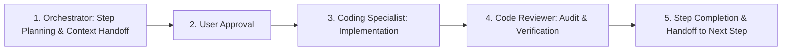

# Methik - Project Agent Instructions & Multi-Agent Workflow

## Overview & Mission
Methik is an ultra-lightweight, **100% portable**, modular YouTube Video & Audio Downloader desktop application.
It integrates with `yt-dlp` to fetch metadata and stream downloads, wrapped in a high-performance **Rust (Tauri v2)** backend and a **Frosted Glass (Glassmorphism)** minimalist frontend.

## Multi-Agent Development Workflow

To ensure zero hallucination, maximum code quality, and strict adherence to architecture, development proceeds under a structured multi-agent protocol:



1. **`/orchestrator`**:
   - Decomposes the task into atomic, checkable steps.
   - Formulates the exact scope, files, and verification plan.
   - Obtains explicit user approval before execution.
2. **`/coding-specialist`**:
   - Implements the approved step completely without placeholders.
   - Follows strict modularity, clean error handling, and memory/size efficiency.
3. **`/code-reviewer`**:
   - Audits the newly implemented code for security, performance, DRY principles, and adherence to portability/monochrome SVG rules.
   - Verifies tests and compilation before signing off on the step.

---

## Key Architectural Principles

1. **100% Portability & Shared Library Architecture**:
   - The user does **NOT** need to manually install Python, `yt-dlp`, or `ffmpeg` to their system `$PATH`.
   - External binaries are shared across apps in `%LOCALAPPDATA%/curlyzed/bin/` (and `%LOCALAPPDATA%/curlyzed/`) to prevent duplicate storage.
   - Methik maintains isolated logs and settings in `%APPDATA%/Methik/` (`logs/`, `config/`).
   - The application includes an auto-provisioner module that silently/transparently downloads and verifies `yt-dlp.exe`, `ffmpeg.exe`, `ffprobe.exe`, and `deno.exe` directly into the shared library directory.
   - Priority binary resolution:
     1. `%LOCALAPPDATA%/curlyzed/bin/` and `%LOCALAPPDATA%/curlyzed/` (Shared curlyzed libraries)
     2. `%APPDATA%/Methik/bin/` (isolated Methik AppData fallback)
     3. Relative `./bin/` (portable USB mode)
     4. System `$PATH` fallback

2. **Strict Non-Monolithic / Layered Design**:
   - **Presentation (Frontend)**: Vanilla HTML5, Vanilla CSS3 (Glassmorphism), Vanilla ES6+ JS. Zero heavy JS frameworks (React, Vue, Node.js runtime).
   - **Tauri IPC Command Layer** (`src-tauri/src/commands/`): Thin orchestrators exposing commands and emitting async progress events.
   - **Core Domain** (`src-tauri/src/core/`): Pure data models (`VideoMetadata`, `PlaylistMetadata`, `DownloadProgress`, `FormatInfo`), traits (`Downloader`, `ProgressObserver`), and strongly-typed errors (`thiserror`).
   - **Engine Layer** (`src-tauri/src/engine/`): Dependency locator, AppData auto-provisioner, argument builder, stdout stream parser, and child process executor.

3. **UI, Aesthetics & Iconography Standards**:
   - **Monochrome Minimal Vector SVGs Only (STRICT ZERO EMOJI POLICY)**: NEVER use system emojis (e.g. ⚡, ⚙️, 🎵, ✓, ✕) or colored characters anywhere in text, labels, status messages, or UI elements. All indicators must use crisp, lightweight monochrome stroke SVGs (`currentColor`).
   - **Custom Frosted Glass Dropdowns (NO Native OS `<select>`)**: Native OS `<select>` popup menus are forbidden because WebView2/Windows renders opaque, unstyled grey/white boxes. All dropdown menus must be custom glassmorphic overlay components (`backdrop-filter: blur(28px)`, translucent borders, smooth hover animations).
   - **Frosted Glass (Glassmorphism)**: `backdrop-filter: blur(28px)`, subtle translucent borders (`rgba(255, 255, 255, 0.12)`), deep ambient cyan/violet glows.
   - **Alitken-inspired Controls**: Titlebar pin toggle (`Always on Top`), Settings modal (themes & engines), About modal (credits & logs), first-launch missing dependencies warning banner.

4. **Smallest Binary Footprint**:
   - Uses OS-native webview (WebView2 on Windows).
   - Cargo release build size optimizations: `opt-level = "z"`, `lto = true`, `codegen-units = 1`, `panic = "abort"`, `strip = true`.
   - Frontend bundle total size stays under **50 KB**.

## Directory Structure
```text
methik/
├── .agents/
│   └── rules/
│       ├── architecture.md       # Architectural rules and guidelines
│       └── workflow.md           # Multi-agent workflow rules
├── AGENTS.md                     # This reference file
├── Cargo.toml                    # Root workspace config
├── src-tauri/                    # Rust backend
│   ├── Cargo.toml
│   ├── tauri.conf.json
│   └── src/
│       ├── main.rs
│       ├── lib.rs
│       ├── commands/             # Tauri IPC handlers
│       ├── core/                 # Models, errors, traits
│       ├── config/               # Settings & AppData paths
│       └── engine/               # yt-dlp & ffmpeg engine & auto-provisioner
└── ui/                           # Minimalist Frosted Glass Webview
    ├── mockup.html               # Reference design mockup
    ├── index.html
    ├── css/
    │   └── style.css
    └── js/
        ├── app.js
        └── api.js
```
